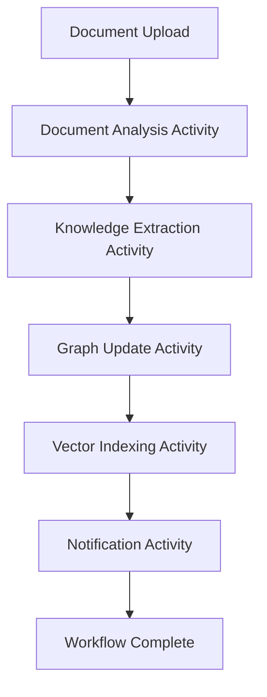
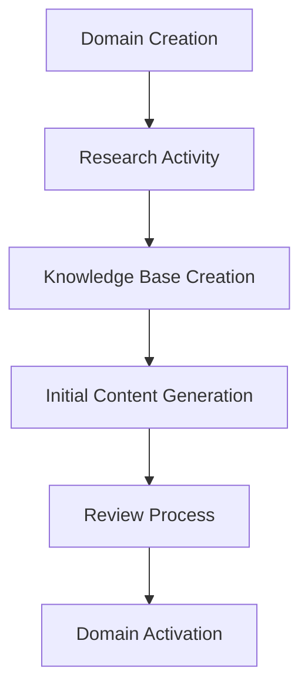

# Hey.sh Architecture Guide

## 🏗️ System Overview

Hey.sh is a knowledge management platform built with modern microservices architecture, featuring Temporal workflows, FastAPI, and comprehensive local development setup.

## 🎯 Core Components

### **Backend Services**
- **FastAPI Server**: REST API with WebSocket support
- **Temporal Workflows**: Long-running, fault-tolerant processes
- **Temporal Activities**: Individual units of work
- **Temporal Workers**: Process workflow and activity tasks

### **Data Layer**
- **PostgreSQL**: Primary database (Temporal + application data)
- **Neo4j**: Knowledge graph for relationships
- **Weaviate**: Vector database for semantic search
- **Redis**: Caching and session storage
- **MinIO**: Object storage (Supabase alternative)

### **Infrastructure**
- **Caddy**: Reverse proxy with automatic HTTPS
- **Docker**: Containerized services
- **Monitoring**: Prometheus, Grafana, Alertmanager, Jaeger, Loki

## 🔄 Workflow Architecture

### **Document Processing Workflow**


### **Domain Bootstrap Workflow**


## 🌐 Network Architecture

### **Local Development**
```
Browser → Caddy (Port 80/443) → Services
├── Frontend (Port 3000)
├── API Server (Port 8002)
├── Temporal UI (Port 8090)
├── Neo4j (Port 7474)
├── Weaviate (Port 8082)
├── PostgreSQL (Port 5432)
├── Redis (Port 6379)
└── MinIO (Port 9000)
```

### **Production Deployment**
```
Internet → Load Balancer → Caddy → Services
├── Frontend (Container)
├── API Server (Container)
├── Temporal (Container)
├── Databases (Managed Services)
└── Monitoring (Containers)
```

## 🔐 Security Architecture

### **Authentication & Authorization**
- **JWT Tokens**: Stateless authentication
- **Supabase Auth**: User management
- **Role-based Access**: User permissions
- **API Keys**: Service-to-service authentication

### **Network Security**
- **HTTPS Everywhere**: TLS encryption for all communications
- **CORS Configuration**: Cross-origin request handling
- **Rate Limiting**: API protection
- **Input Validation**: Pydantic schemas

## 📊 Monitoring Architecture

### **Metrics Collection**
- **Prometheus**: Metrics scraping and storage
- **Node Exporter**: Host metrics
- **Custom Metrics**: Application-specific metrics

### **Logging**
- **Structured Logging**: JSON-formatted logs
- **Loki**: Log aggregation
- **Promtail**: Log shipping

### **Tracing**
- **Jaeger**: Distributed tracing
- **OpenTelemetry**: Instrumentation

### **Alerting**
- **Alertmanager**: Alert routing
- **Grafana**: Dashboards and visualization

## 🔧 Development Architecture

### **Local Development Setup**
- **Docker Compose**: Infrastructure services
- **Hot Reload**: FastAPI development server
- **SSL Certificates**: mkcert for local HTTPS
- **Hostname Mapping**: `.hey.local` domains

### **Configuration Management**
- **Environment Variables**: Runtime configuration
- **Centralized Config**: `src/config/` directory
- **Hostname Management**: Dynamic URL generation
- **Protocol Detection**: HTTP vs HTTPS

## 🚀 Deployment Architecture

### **Container Strategy**
- **Multi-stage Builds**: Optimized Docker images
- **Specialized Workers**: AI, Storage, General workers
- **Resource Allocation**: CPU and memory limits
- **Node Affinity**: Worker placement

### **Kubernetes Deployment**
- **GKE Autopilot**: Managed Kubernetes
- **Horizontal Pod Autoscaling**: Dynamic scaling
- **Service Mesh**: Istio for traffic management
- **Ingress**: External traffic routing

## 🔄 Data Flow

### **Document Processing**
1. **Upload**: Document uploaded via API
2. **Analysis**: Temporal workflow processes document
3. **Extraction**: Knowledge extracted and structured
4. **Storage**: Data stored in multiple databases
5. **Indexing**: Vector embeddings created
6. **Notification**: User notified of completion

### **Search Flow**
1. **Query**: User submits search query
2. **Vector Search**: Weaviate finds similar content
3. **Graph Traversal**: Neo4j finds related entities
4. **Ranking**: Results ranked by relevance
5. **Response**: Structured results returned

## 🎯 Scalability Considerations

### **Horizontal Scaling**
- **Stateless Services**: API servers can scale horizontally
- **Worker Scaling**: Temporal workers can scale based on load
- **Database Scaling**: Read replicas and sharding strategies

### **Performance Optimization**
- **Caching**: Redis for frequently accessed data
- **Connection Pooling**: Database connection management
- **Async Processing**: Non-blocking operations
- **CDN**: Static asset delivery

## 🔧 Development Workflow

### **Code Organization**
- **Clean Architecture**: Dependency inversion
- **Domain-Driven Design**: Business logic separation
- **Test-Driven Development**: Comprehensive test coverage
- **Code Quality**: Linting, formatting, type checking

### **Deployment Pipeline**
- **CI/CD**: Automated testing and deployment
- **Environment Promotion**: Dev → Staging → Production
- **Rollback Strategy**: Safe deployment rollbacks
- **Monitoring**: Deployment health checks

## 📈 Future Enhancements

### **Planned Features**
- **Multi-tenancy**: Tenant isolation
- **Advanced Analytics**: Usage metrics and insights
- **API Versioning**: Backward compatibility
- **GraphQL**: Flexible data querying

### **Infrastructure Improvements**
- **Service Mesh**: Advanced traffic management
- **GitOps**: Infrastructure as code
- **Chaos Engineering**: Resilience testing
- **Cost Optimization**: Resource efficiency

---

This architecture provides a solid foundation for a scalable, maintainable knowledge management platform with comprehensive local development capabilities.
